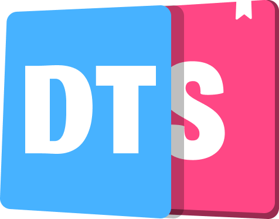
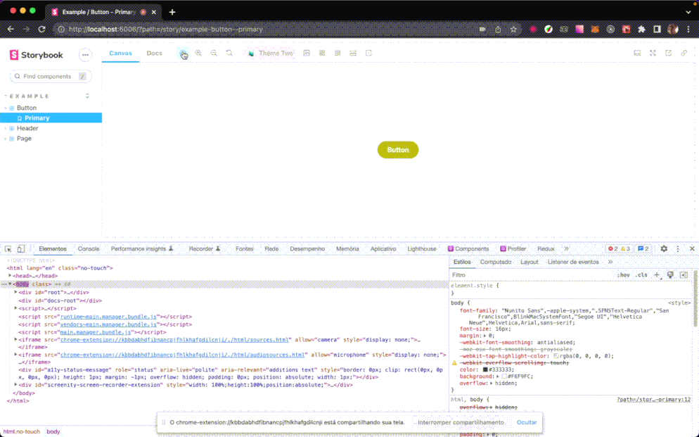

<div align="center">
  
  <br/>
  <br/>
</div>
<hr/>

## Design Tokens with variables CSS

Add your Themes using variables css and use them in your components.

create components with variables css, based on the theme you want to use.

## Step by step

- [ ] install addon npm or yarn
- [ ] add .storybook/main.(js,ts)  
- [ ] config your themes in .storybook/preview.(js,ts)

## Link example

| host | Desc | Links |
|--|--|--|
| code and preview | Simple example | [Link](https://stackblitz.com/edit/storybook-design-tokens-css?file=.storybook/preview.js) |
| code and preview | Example with custom panel storybook variables | [Link](https://stackblitz.com/edit/storybook-design-tokens-css-141ywl?file=.storybook/manager-head.html) |
---

## Image example

<div align="center">
  
  <br/>
  <br/>
</div>
<hr/>

## Requirements

- Storybook@>=6.0.0

  This addon should work well with any framework: If you find the case the addon not works, please open an issue.

## Getting started

### 1. Install

```sh
npm install --save-dev @outlinestudio/designtokenscss
# yarn add -D @outlinestudio/designtokenscss
```

### 2. Register the addon in `.storybook/main.(js,ts)`

```js
module.exports = {
  addons: ["@outlinestudio/designtokenscss"],
};
```

### 3. Register the addon in `.storybook/preview.(js,ts)`

```js
export const parameters = {
  designTokensCss: {
      label: 'Themes',
      persistData: true,
      themes: [
        {
          "name": "Theme One",
          "miniLogo": "",
          "tokens": {
            ## add all yours css variables here
            "--yours-primary": "#c8c615",
            "--yours-primary-text": "#faf9e8",
            "--yours-primary-container": "#b4b213",
            "--yours-primary-light": "#e9e8a1",
            "--yours-primary-dark": "#62610a",
            "--yours-primary-hover": "#969510" 
            ## add all yours css variables here
          }
        },
        {
          "name": "Theme Two",
          "miniLogo": "https://javisperez.github.io/tailwindcolorshades/img/icons/favicon-16x16.png",
          "tokens": {
            ## add all yours css variables here
            "--yours-primary": "#c8c615",
            "--yours-primary-text": "#faf9e8",
            "--yours-primary-container": "#b4b213",
            "--yours-primary-light": "#e9e8a1",
            "--yours-primary-dark": "#62610a",
            "--yours-primary-hover": "#969510"
            ## add all yours css variables here
           }
        },
      ]
    }
```

### Types addon

| Parameter   | type                                                                                              | obs                                                               |
| ----------- | ------------------------------------------------------------------------------------------------- | ----------------------------------------------------------------- |
| label       | string                                                                                            | parameter text setting in select default                          |
| persistData | boolean                                                                                           | set persistData to save theme selected in localStorage load start |
| themes      | [ThemeType\[\]](https://github.com/raulmelo/addon-variablecss-theme/blob/main/src/utils/types.ts) | Array with themes and yours properties css variable               |

#### Themes

| Parameter | type            | obs                                  |
| --------- | --------------- | ------------------------------------ |
| name      | string          | Name theme                           |
| miniLogo  | string optional | Mini logo theme show in select       |
| tokens    | Object          | Declare name and value css variables |

# Exemplo config with themes

#### example config

<details><summary>Example files</summary>

<p>

#### in themes add yours variables

```javascript
  export const parameters = {
    designTokensCss: {
      label: "Themes",
      persistData: true,
      themes: [
        {
        "name": "Theme one",
        "tokens": {
          "font-family": "Roboto, sans-serif",
          "primary": "#fcfc30",
          "primary-text": "#00A8FF",
          "primary-container": "#fcf130",
          "primary-light": "#fcfc30",
          "primary-dark": "#FFFFFF",
          "primary-hover": "#fae128",
          "secondary": "#465eff",
          "secondary-text": "#fff",
          "secondary-container": "#2f4af8",
          "secondary-light": "#465eff",
          "secondary-dark": "#465eff",  
          "secondary-hover": "#465eff",
          "background": "#fcfc30",
          "text": "#000"
        }
      },
      {
        "name": "Theme Two",
        "miniLogo": "https://javisperez.github.io/tailwindcolorshades/img/icons/favicon-16x16.png",
        "tokens": {
          "primary": "#c8c615",
          "primary-text": "#faf9e8",
          "primary-container": "#b4b213",
          "primary-light": "#e9e8a1",
          "primary-dark": "#62610a",
          "primary-hover": "#969510",
          "secondary": "#8a59a7",
          "secondary-text": "#f3eef6",
          "secondary-container": "#7c5096",
          "secondary-light": "#d0bddc",
          "secondary-dark": "#533564",  
          "secondary-hover": "#533564",
          "background": "#fcfc30",
          "text": "#000"
        }
      },
      {
        "name": "Theme Tree",
        "miniLogo": "https://www.gclaims.com.br/assets/images/favicon/favicon-16x16.png",
        "tokens": {
          "primary": "#00a8ff",
          "primary-text": "#e6f6ff",
          "primary-container": "#007ebf",
          "primary-light": "#99dcff",
          "primary-dark": "#006599",
          "primary-hover": "#007ebf",
          "secondary": "#00c9a8",
          "secondary-text": "#e6faf6",
          "secondary-container": "#00c9a8",
          "secondary-light": "#4dd9c2",
          "secondary-dark": "#00977e",  
          "secondary-hover": "#00b597",
          "background": "#fcfc30",
          "text": "#000"
        }
      }
    ]
    }
  }
```

</p>
</details>

### Set yours themes in storybook panel (OPTIONAL)

You can change panel default in storybook, all custom accept in css variables through file `.storybook/manager-head.html`.
adding in styles tag with yours variable custom with params.  
[Example with storybook theme custom panel](https://stackblitz.com/edit/storybook-design-tokens-css-141ywl?file=.storybook/manager-head.html)

example:
<details><summary>Example optional</summary>
<div align="center">
  
  <br/>
  <br/>
</div>
<details>
